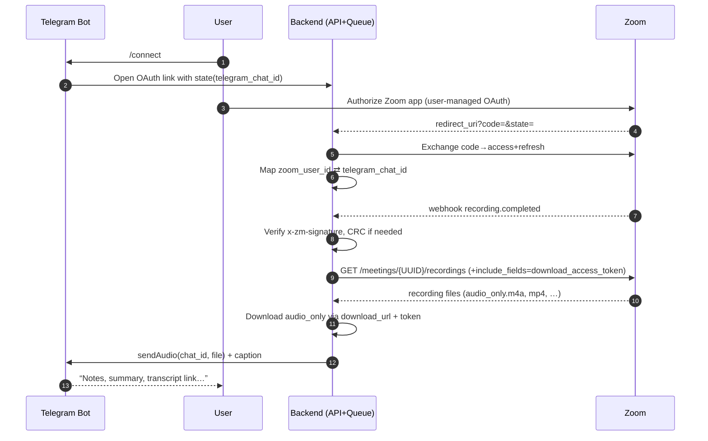

PRD — Zoom Recording → Telegram Delivery (Multi-tenant)

## 1) Overview
Enable any Telegram user to connect their Zoom account once and automatically receive audio and a concise summary in their Telegram chat when a Zoom cloud recording completes.

## 2) Goals
- **One-tap connect**: `/connect` deep-link opens Zoom OAuth; support multi-tenant mapping of `zoom_user_id` ⇄ `telegram_chat_id`.
- **Hands-free delivery**: When Zoom emits `recording.completed`, fetch audio-only, process, and send to Telegram.
- **Secure-by-default**: HMAC signature validation, CRC handling, state JWT, token refresh, idempotent processing.

## 3) Non-goals
- Joining meetings or live capture/streaming.
- Video processing beyond downloading and forwarding audio-only.
- Real-time transcription; rely on post-meeting recordings and optional Zoom transcript events.

## 4) Primary Personas
- **Zoom Host**: Records meetings to the cloud and wants instant delivery of audio and notes to Telegram.
- **Telegram User**: Receives files and summaries in a private chat with the bot.

## 5) User Stories
- As a user, I can run `/connect` and complete Zoom OAuth to link my account.
- As a user, I receive the audio file and a summary in Telegram after each recorded meeting.
- As a user, I can `/disconnect` to revoke access and delete stored tokens.
- As a user, I can see connection status via `/status`.

## 6) System Flow


## 7) Functional Requirements
- **OAuth connect**: User-managed app. Scopes: `recording:read`; optional `user:read` for names/avatars.
- **State & mapping**: JWT `state` includes `chat_id` and `telegram_user_id`, signed with `STATE_SECRET`.
- **Webhook**: Endpoint validates `x-zm-signature` on every POST and responds to `endpoint.url_validation` CRC within ≤3s.
- **Recording handling**:
  - Trigger on `recording.completed` (optional `recording.transcript_completed`).
  - Call Get Meeting Recordings; double-encode UUID; request `include_fields=download_access_token&ttl=60`.
  - Prefer `recording_type == "audio_only"`; fallback to best available.
  - Download via `download_url` using OAuth token or short-lived `download_access_token`.
  - Idempotency: de-duplicate by `(zoom_meeting_uuid, file_id)`.
- **Telegram delivery**: Use `sendAudio` (≤2 GB). Caption includes topic, start time, and summary link/text.
- **Deauthorization**: Handle Zoom Deauthorization Notification; revoke and purge tokens/mapping.

## 8) API Surface (Backend)
- `GET /zoom/connect?telegram_chat_id={int}&telegram_user_id={int}` → `{ authorize_url }`.
- `GET /zoom/callback?code&state` → exchanges tokens, maps `zoom_user_id` to Telegram identifiers.
- `POST /webhooks/zoom` → handles `endpoint.url_validation` and events (e.g., `recording.completed`).
- `POST /webhooks/zoom/deauth` → Zoom deauthorization webhook (data retention compliance).

## 9) Data Model (sketch)
- `users(id, telegram_user_id, chat_id, locale)`
- `zoom_connections(id, user_id, zoom_user_id, access_token, refresh_token, expires_at)`
- `meetings(id, zoom_meeting_uuid, topic, start_time, owner_zoom_user_id)`
- `recordings(id, meeting_id, file_id, file_type, download_url, status)`
- `jobs(id, recording_id, status, attempts, last_error, created_at)`

Indexes & constraints:
- Unique on `zoom_connections.zoom_user_id`.
- Idempotency key: unique `(recordings.meeting_id, recordings.file_id)`.

## 10) Security & Compliance
- **Webhook signature**: `HMAC-SHA256(secret, "v0:{timestamp}:{rawBody}")` → compare to `x-zm-signature`.
- **CRC**: Echo `{ plainToken, encryptedToken }` (HMAC-SHA256 of `plainToken`) within 3s.
- **State JWT**: Validate signature and reasonable timestamp skew.
- **Token storage**: Encrypt at rest; refresh on expiry; least-privilege scopes.
- **Transport**: HTTPS only; strict TLS; no tokens in logs.
- **Rate limiting**: Protect endpoints; exponential backoff on Zoom 429/5xx.
- **PII**: Minimize retention; configurable TTL for downloaded media; redact logs.

## 11) Failure Handling
- Invalid signature/CRC → 401/400 without body details.
- User not connected → acknowledge event and no-op.
- Recording not yet ready/passcode-protected → retry with backoff.
- Large files >2 GB → fall back to `sendDocument` or skip with user notice.
- Dead-letter queue after N attempts with alerting.

## 12) Observability
- Metrics: connect conversions, webhook validations, downloads started/succeeded/failed, delivery latency, retry counts.
- Logs: structured JSON; correlation IDs per event/meeting.
- Alerts: high failure rate, CRC failures, token refresh failures, queue depth.

## 13) Rollout Plan
- Phase 1: OAuth connect, `recording.completed`, audio delivery, minimal summary caption.
- Phase 2: Prefer Zoom transcript if `recording.transcript_completed`; deeper captions with links.
- Phase 3: Deauthorization cleanup, `/status` UX polish, rate-limit hardening.

## 14) Environment Variables
```
ZOOM_CLIENT_ID=
ZOOM_CLIENT_SECRET=
ZOOM_REDIRECT=https://api.yourapp.com/zoom/callback
ZOOM_WEBHOOK_SECRET=
STATE_SECRET=
TELEGRAM_BOT_TOKEN=
```

## 15) Open Questions
- Queue/runtime: Celery/RQ/Arq/BackgroundTasks? Target SLO for delivery?
- Storage: temporary file system vs object storage for downloaded media?
- Summary source: reuse internal summarization pipeline or Zoom transcript preference order?


